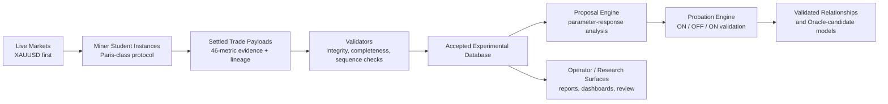
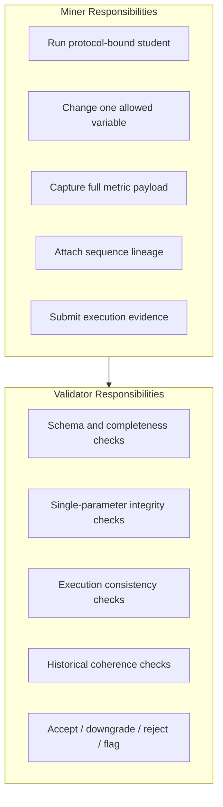
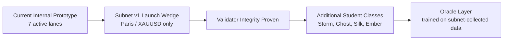
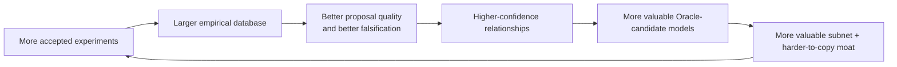

# Classroom Subnet

## Visual Architecture Draft

Date: 2026-03-21  
Prepared by: DC

## 1. System Flow

## 2. Miner / Validator Boundary

## 3. Launch Wedge

## 4. Value Creation Loop

## 5. Message For Submission Use

If this is used in the Bitstarter packet, the visual should support one simple story:

- miners do not submit predictions
- miners submit experiments
- validators defend protocol honesty
- the accepted output becomes a compounding empirical database
- the first launch wedge is intentionally narrow so the validator path is believable
